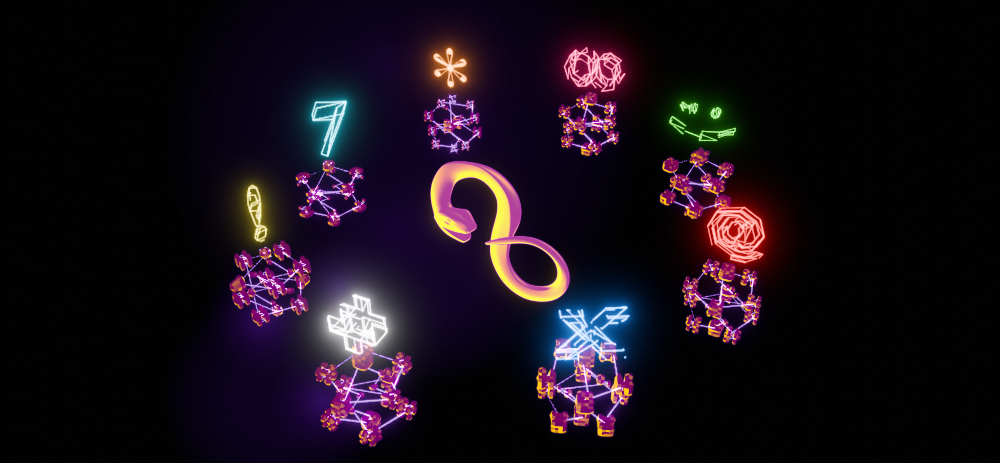
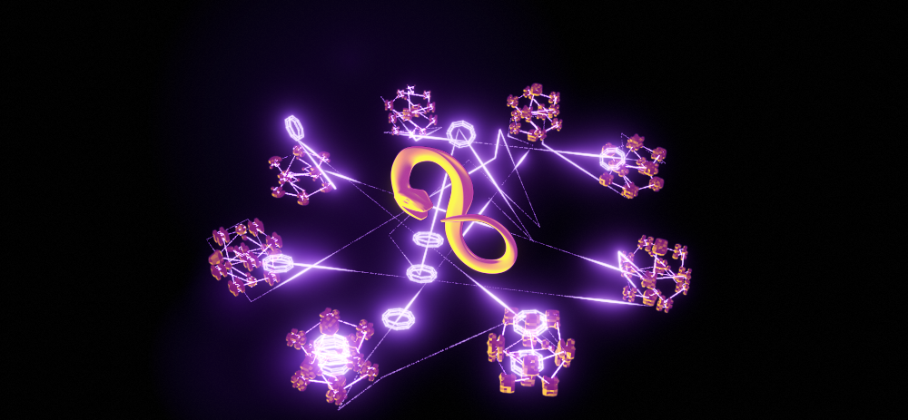

### Mint Mark

Within the Oroboros Network, all who mint XRO with ICP or Chain Key tokens are called 'Generators'.  All Generators benefit from the ephemeral phase of the network. Those mint with Chain Key tokens will be assigned the special status of 'Benefactor'.

To incentivize minting XRO with Chain Key tokens, the network offers additional features.  Benefactors will have the ability to create a mint mark.  A mint mark is essentially a unique namespace on the network, with the ability to onboard users under your unique namespace.  The network also allows Benefactors to store a url for a png image logo related to their business or community.  The goal of  Oroboros Network is to provide a generalized solution for content creators to use tokens to generate business or user interaction within their own communities.  As such, these benefits can only be realized by minting XRO with CkBTC or CkETH.

A token mark can be any alpha-numeric string with a maximum length of 128 characters.  Special characters are allowed with the exception of the following characters:

| prohibited characters | "\|" (pipe),"\\" (back slash), and  "/" (forward slash) |
| --- | --- |

&nbsp;

The network allows any user to join a generation.  Which means the user can have a unique sub-namespace called a 'Moniker' under a Benefactors mark. This enables benefactors to create interactions specific to their individual community. Like Generators, a Principal can only be associated with a single Moniker with a particular Mark. A user must pay 8 XRO in order to join a generation.  It is up to Benefactor whether or not they want subsidize the cost using their supply of tokens, or stimulate the price of XRO by requiring their users to purchase XRO online.

### Ephemeral Token Drops

Benefactors have the ability to stimulate activity for their users by creating ephemeral token drop events. The can create token air drops of XRO that can be collected by users in generations(communities) associated with their particular mark.  When a benefactor creates a new drop event, a limited number of slots must be assigned.  Only users who are part of their particular generation(community) can join a drop event.

The cost to create a drop event is 25% of the amount for a single air drop. Only a benefactor can create the event.  Only a single event may be created at a time.  If an event has been created, and a Benefactor wants to create a new one, the existing must be deleted.