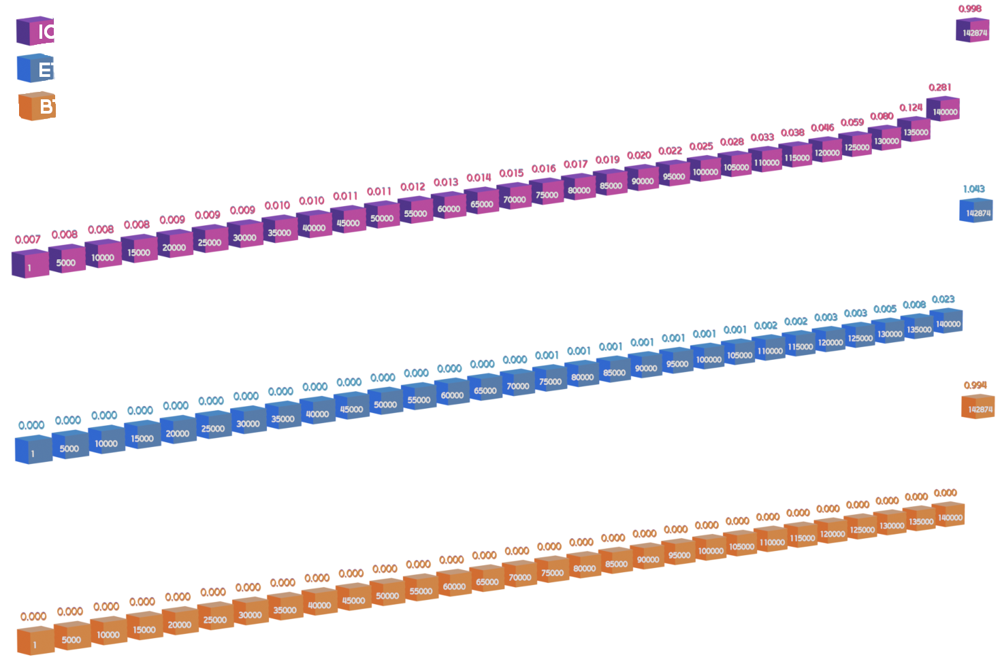

### Mint Requirements

Users who mint XRO for ICP or Chain Key tokens are called 'Generators' on the Oroboros network. There can only be one Generatot per ICP Principal on the network.  Which means, for a user to mint more than once, they would need to create a new Principal with unique seed phrase each time they want to mint a batch of tokens. This is discourage multiple mint batches for a single user.

### Mint Cost

XRO is mintable in exchange for ICP and Chain Key tokens.  The cost of minting is mathematically designed to stay relatively stable over time. Once the max number of Generators(Depositors) is met, the cost to mint the token will reach parity with the actual price of the corresponding Chain Key token.

\*Price of one XRO in Chain Key token, sampled at every 5000 generations. Actual start and end prices over generation cycle shown below.

| Start Price ICP | End Price ICP | Start Price ETH | End Price ETH | Start Price BTC | End Price BTC |
| --- | --- | --- | --- | --- | --- |
| 0.007812500 | 0.998225377 | 0.00048828125 | 1.043277334 | 0.000003814697265 | 0.9946714455987 |

Above prices converted to US Dollar equivalents:

| @$20 ICP == $0.15 | Parity with ICP | @$4000 ETH == $1.95 | Parity with ETH | @$100k BTC == $3.81 | Parity with BTC |
| --- | --- | --- | --- | --- | --- |