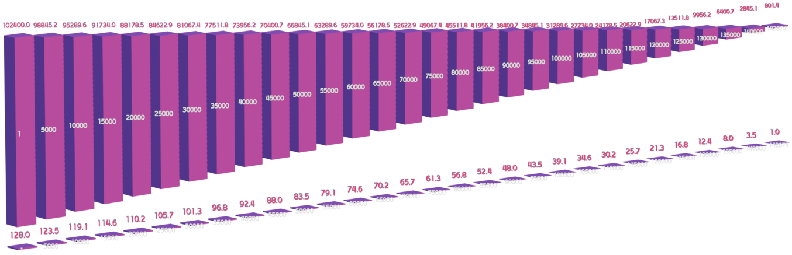
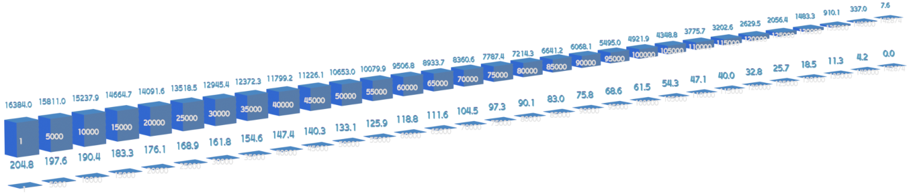
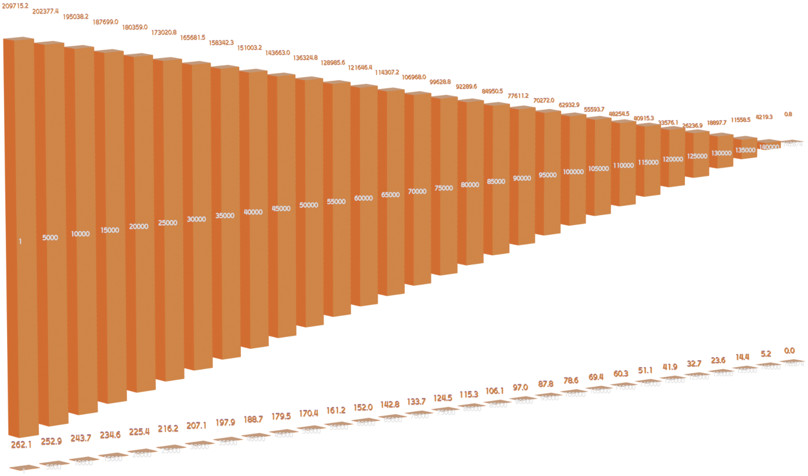
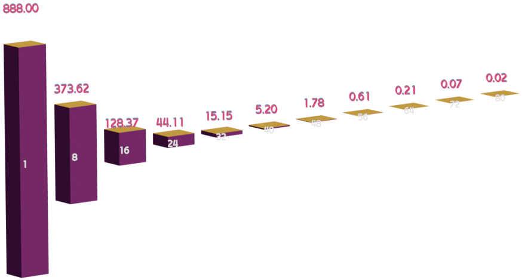
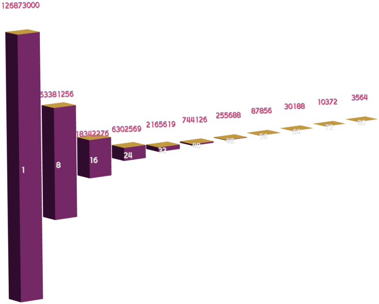

### Max Supply (Phase One)

XRO token minting life span happens over two phases.  The first phase is a 'Mint for Token' phase, whereby the tokens are minted in exchange for ICP, CkETH, or CkBTC at algorithmic exchange rates.

There is no hard max supply, the supply is generated by depositing Chain Key Tokens to the network.  Each token allows the Generator(Depositor), to mint XRO at algorithmic exchange rates. The rates are designed to make ICP cheaper for conversion compared to Chain Key tokens.  With each 'Mint from Token' Generation, the price to mint tokens becomes slightly more expensive:

* * *

### Mint for ICP

\*Supply of XRO sampled at every 5000 generations.

| Mint from ICP First Gen Max Supply | Mint from ICP Last Gen Max Supply | Mint from ICP First Gen Min Supply | Mint from ICP Last Gen Min Supply |
| --- | --- | --- | --- |
| 102400 | 801.4 | 128 | 1   |

* * *

### Mint for CkETH

\*Supply of XRO sampled at every 5000 generations.

| Mint from ETH First Gen Max Supply | Mint from ETH Last Gen Max Supply | Mint from ETH First Gen Min Supply | Mint from ETH Last Gen Min Supply |
| --- | --- | --- | --- |
| 16384 | 7.6 | 204.8 | 0   |

* * *

### Mint for CkBTC

\*Supply of XRO sampled at every 5000 generations.

| Mint from BTC First Gen Max Supply | Mint from BTC Last Gen Max Supply | Mint from BTC First Gen Min Supply | Mint from BTC Last Gen Min Supply |
| --- | --- | --- | --- |
| 209715.2 | 0.8 | 262.1 | 0   |

* * *

&nbsp;

## Estimated Cumulative Supply (Phase One) Mint for Token

|     | Min | Max |
| --- | --- | --- |
| **ICP** | 9215499.9 | 7372399333.2 |
| **ETH** | 14637144.9 | 1170971597.1 |
| **BTC** | 18726852.7 | 14981482198.1 |

&nbsp;

## Cumulative Supply (Phase Two) Ephemeral Minting

After the threshold of the 'Mint for Token' Cycle is meant at 142875 Generations, the network enters it's second phase.  During this phase, XRO Rewards will be minted to every 'Generator' in cycles.  Each 'Ephemeral Mint Cycle' lasts approximately one year.  There are 81 cycles across the lifespan of the XRO minting life cycle.

&nbsp;

\*Supply of XRO sampled at every 8 cycles.

| XRO Reward per Account First Cycle | XRO Reward per Account Last Cycle |
| --- | --- |
| 888 | 0.2 |

\*Supply of XRO sampled at every 8 cycles.

| Cumulative XRO Reward per Account First Cycle | Cumulative XRO Reward per Account Last Cycle |
| --- | --- |
| 126873000 | 3564.2 |

## Total Cumulative Supply Estimates

Taking lowest minimum and highest maximum from the 'Mint for Token' cycle, and combing those with the Total calculated minted XRO from the 'Ephemeral Mint' Cycle, a estimated range for max supply of XRO:

| Minimum | Maximum |
| --- | --- |
| 1087614168.8 | 16059880867 |