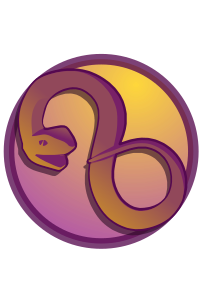

## 

roboros is a revolutionary token that operates on the principle 'Time is Money', where time itself becomes a form of money. It's designed to be a practical and ephemeral utility for any type of organization, making it ideal as a general-use monetary network. Our goal? To create useful incentives or engagements for your users so you can earn more money while using less time. 
As an 'Oroboros Generator', you not only benefit from your initial contribution, but also contribute to the broader sustainability of our system.  However, once a certain limit of Generators has been reached, the protocol enters phase where tokens are minted over time, giving all Generators a say in how the currency flows. This means you – as a Generator – ultimately have control over the flow of your money, and can use it however you see fit.  Oroboros Network offers exclusive access to special services on the network.  If this sounds interesting, read on, and see if the network has something of value for your organization.

Benjamin Franklin once said,  "Lost time is never found again".  Perhaps by leveraging Oroboros, lost time may be repaid to you in the future.